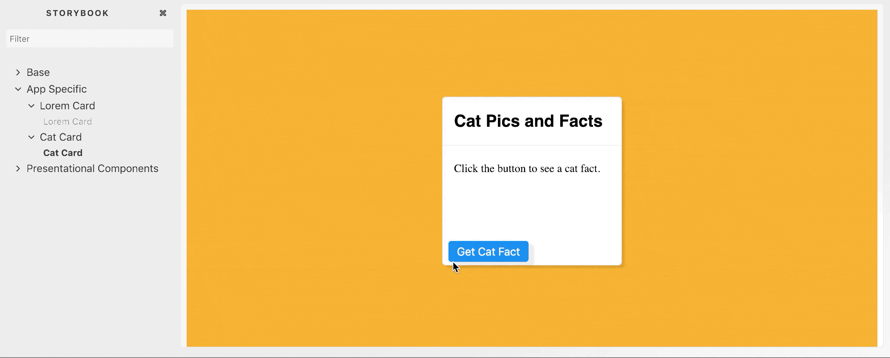
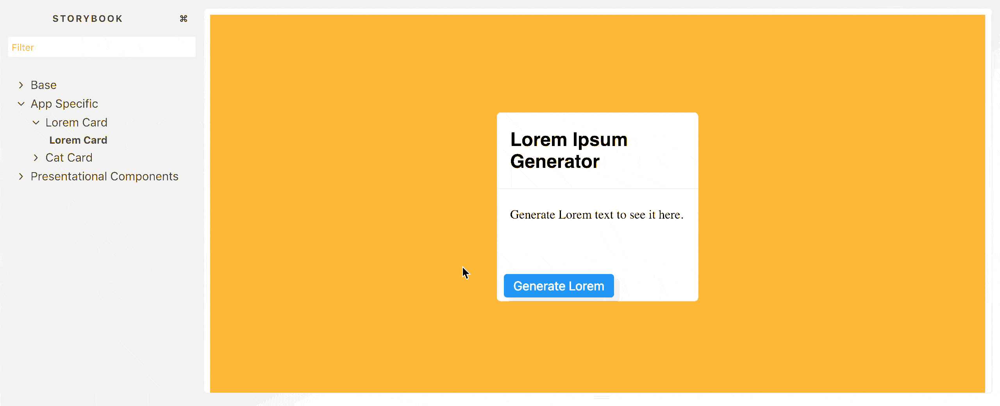
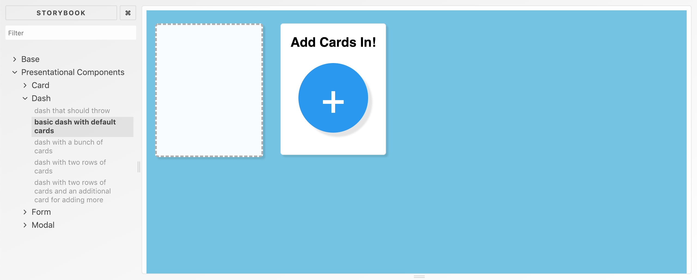
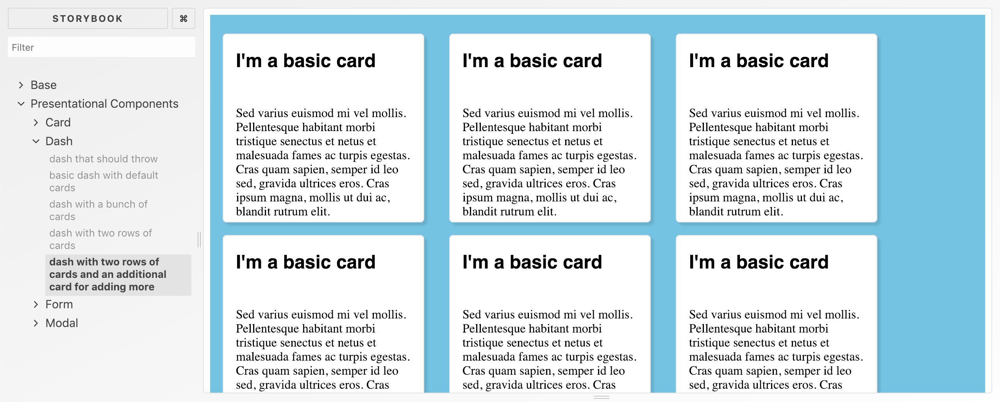

# Current Progress

## Features Completed

- App Specific Cards
  - Cat facts and image

  

  - Lorem generator

  

- Dash
  - Dashboard with default card and an additional card that displays a dialog box for adding more in

  

  - Basic dashboard with generic cards

  

- Forms
  - TBA
- Modals
  - Simple modals with multiple ways of closing it

    

  - Multiple different modals

    
